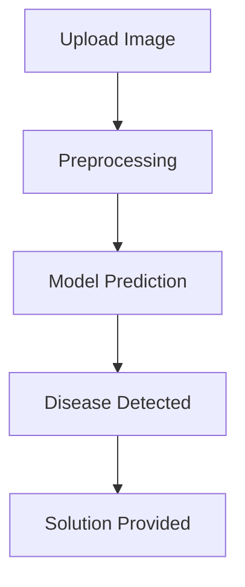

# 🌿 AI Crop Disease Detection System

<p align="center">
  
</p>

---

## Application demo

<p align="center">
  
</p>
---


---

## 🏆 Badges


---

## 🧠 About the Project

This project is an **AI-powered Crop Disease Detection System** 🌱
It uses **Deep Learning (CNN)** to identify plant diseases from images and provides **instant solutions**.

---

## ✨ Features

* 📷 Image-based disease detection
* 🧠 CNN model using TensorFlow/Keras
* ⚡ Fast predictions
* 💊 Disease solution suggestions
* 🌍 Beginner-friendly UI

---

## 🛠️ Tech Stack

| Category    | Tech              |
| ----------- | ----------------- |
| 💻 Language | Python            |
| 🧠 ML       | TensorFlow, Keras |
| 📊 Notebook | Google Colab      |
| 🌐 UI       | Flask / Streamlit |

---

## 📂 Project Structure

```bash
project-folder/
│── model.keras
│── app.py
│── README.md
```

---

## ⚙️ How It Works


Note: The model performs best on trained crop categories
such as tomato, potato, and pepper.
---

## ▶️ Installation

```bash
git clone https://github.com/harshit2537/Ai_crop_doctor/tree/main
cd Ai_crop_doctor
pip install -r requirements.txt
python app.py
```

---


---


---

## 🚀 Future Improvements

* 📱 Mobile app
* ☁️ Cloud deployment
* 🎙️ Voice assistant integration
* 🌾 Real-time farm monitoring

---

## 🤝 Contributing

Pull requests are welcome!
If you’d like to improve this project, feel free to fork and contribute 🚀

---

## 📄 License

MIT License

---

## 💡 Author

👨‍💻 **Harshit** **Ankush** **Tanuj**
🚀 AI/ML Developers | Future Innovator

---

<p align="center">
  ⭐ If you like this project, don't forget to star the repo!
</p>
